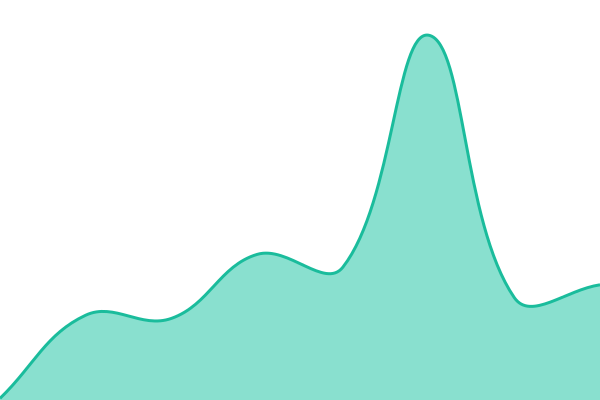
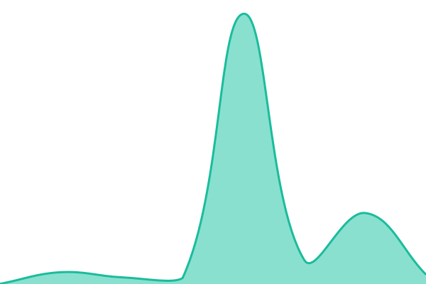
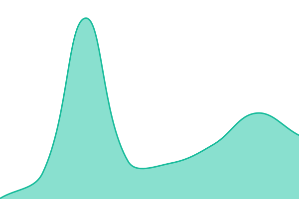
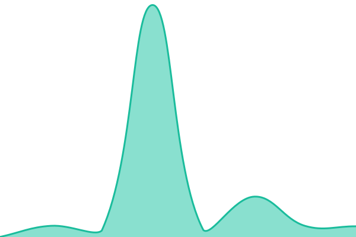
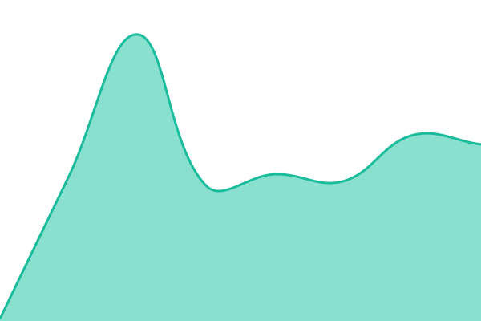

# [📈 Live Status](https://status.dds.dot.ca.gov): <!--live status--> **🟩 All systems operational**

This repository contains the open-source uptime monitor and status page for [California Integrated Travel Project](https://www.calitp.org), powered by [Upptime](https://github.com/upptime/upptime).

With [Upptime](https://upptime.js.org), you can get your own unlimited and free uptime monitor and status page, powered entirely by a GitHub repository. We use [Issues](https://github.com/cal-itp/status/issues) as incident reports, [Actions](https://github.com/cal-itp/status/actions) as uptime monitors, and [Pages](https://status.dds.dot.ca.gov) for the status page.

<!--start: status pages-->
<!-- This summary is generated by Upptime (https://github.com/upptime/upptime) -->
<!-- Do not edit this manually, your changes will be overwritten -->
<!-- prettier-ignore -->
| URL | Status | History | Response Time | Uptime |
| --- | ------ | ------- | ------------- | ------ |
|  [Data Analysis Portfolio](https://analysis.dds.dot.ca.gov) | 🟩 Up | [data-analysis-portfolio.yml](https://github.com/cal-itp/status/commits/HEAD/history/data-analysis-portfolio.yml) | 

 91ms
     
 | 

<a href="https://status.dds.dot.ca.gov/history/data-analysis-portfolio">100.00%</a>
    

|  [GTFS Data](https://gtfs.dds.dot.ca.gov) | 🟩 Up | [gtfs-data.yml](https://github.com/cal-itp/status/commits/HEAD/history/gtfs-data.yml) | 

 90ms
     
 | 

<a href="https://status.dds.dot.ca.gov/history/gtfs-data">100.00%</a>
    

|  [California GTFS Quality Dashboard](https://reports.dds.dot.ca.gov) | 🟩 Up | [california-gtfs-quality-dashboard.yml](https://github.com/cal-itp/status/commits/HEAD/history/california-gtfs-quality-dashboard.yml) | 

 117ms
     
 | 

<a href="https://status.dds.dot.ca.gov/history/california-gtfs-quality-dashboard">100.00%</a>
    

|  [Jupyterhub](https://jupyterhub.dds.dot.ca.gov) | 🟩 Up | [jupyterhub.yml](https://github.com/cal-itp/status/commits/HEAD/history/jupyterhub.yml) | 

 378ms
     
 | 

<a href="https://status.dds.dot.ca.gov/history/jupyterhub">100.00%</a>
    

|  [Metabase](https://metabase.dds.dot.ca.gov) | 🟩 Up | [metabase.yml](https://github.com/cal-itp/status/commits/HEAD/history/metabase.yml) | 

 175ms
     
 | 

<a href="https://status.dds.dot.ca.gov/history/metabase">100.00%</a>
    

|  [dbt Documentation](https://dbt-docs.dds.dot.ca.gov) | 🟩 Up | [dbt-documentation.yml](https://github.com/cal-itp/status/commits/HEAD/history/dbt-documentation.yml) | 

 176ms
     
 | 

<a href="https://status.dds.dot.ca.gov/history/dbt-documentation">100.00%</a>
    

|  [TIDES](https://tides.dds.dot.ca.gov) | 🟩 Up | [tides.yml](https://github.com/cal-itp/status/commits/HEAD/history/tides.yml) | 

 73ms
     
 | 

<a href="https://status.dds.dot.ca.gov/history/tides">100.00%</a>
    

<!--end: status pages-->

[**Visit our status website →**](https://status.dds.dot.ca.gov)

## 📄 License

- Powered by: [Upptime](https://github.com/upptime/upptime)
- Code: [MIT](./LICENSE) © [Anand Chowdhary](https://anandchowdhary.com), supported by [Pabio](https://pabio.com)
- Data in the `./history` directory: [Open Database License](https://opendatacommons.org/licenses/odbl/1-0/)
